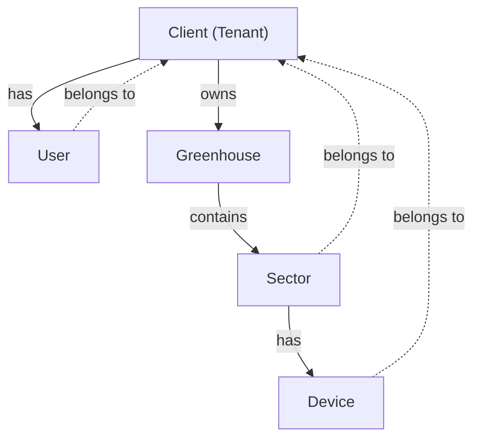

Greenhouse Admin manages a hierarchical data structure that mirrors the physical organization of greenhouse facilities. Understanding this model is essential for working with the application.

## Data hierarchy

The system follows a clear hierarchical structure:

```
Client (Tenant)
  └── Greenhouse
        └── Sector
              └── Device (Sensor/Actuator)
```

<Steps>
  <Step title="Client (Tenant)">
    The top-level entity representing a customer or organization that owns greenhouse facilities.
  </Step>
  
  <Step title="Greenhouse">
    A physical greenhouse facility belonging to a client. Each client can have multiple greenhouses.
  </Step>
  
  <Step title="Sector">
    A subdivision within a greenhouse for organizing plants or zones. Each greenhouse contains multiple sectors.
  </Step>
  
  <Step title="Device">
    IoT devices (sensors or actuators) deployed in sectors to monitor and control the environment.
  </Step>
</Steps>

## Core data models

### Client (Tenant)

Represents a customer organization in the system:

```kotlin ClientModels.kt
@Serializable
data class Client(
    val id: Long,
    val code: String,                    // Auto-generated unique code
    val name: String,
    val email: String,
    val phone: String = "",
    val province: String = "",
    val country: String = "",
    val location: Location? = null,      // GPS coordinates
    val isActive: Boolean? = true,
    val status: ClientStatus = ClientStatus.ACTIVE
) {
    // Computed properties
    val initials: String
        get() = name.split(" ")
            .take(2)
            .mapNotNull { it.firstOrNull()?.uppercaseChar() }
            .joinToString("")
    
    val fullLocation: String
        get() = buildString {
            if (province.isNotBlank()) append(province)
            if (province.isNotBlank() && country.isNotBlank()) append(", ")
            if (country.isNotBlank()) append(country)
        }.ifBlank { "-" }
}

enum class ClientStatus {
    ACTIVE,    // Actively using the system
    PENDING,   // Account pending activation
    INACTIVE   // Deactivated account
}
```

<Info>
Clients are called "Tenants" in the backend API, but "Clients" in the UI for better user understanding.
</Info>

### Greenhouse

Represents a physical greenhouse facility:

```kotlin GreenhouseModels.kt
@Serializable
data class Greenhouse(
    val id: Long,
    val code: String,                    // Auto-generated unique code
    val name: String,
    val tenantId: Long,                  // Foreign key to Client
    val location: Location? = null,      // GPS coordinates
    val areaM2: Double? = null,          // Area in square meters
    val timezone: String? = "Europe/Madrid",
    val isActive: Boolean = true,
    val createdAt: String? = null,
    val updatedAt: String? = null
) {
    val initial: String
        get() = name.firstOrNull()?.uppercaseChar()?.toString() ?: "?"
    
    val areaDisplay: String
        get() = areaM2?.let { "$it m²" } ?: "-"
    
    val locationDisplay: String
        get() = location?.displayString?.takeIf { it.isNotBlank() } ?: "-"
}

enum class GreenhouseStatus {
    ACTIVE,
    INACTIVE;
    
    val displayName: String
        get() = name.lowercase().replaceFirstChar { it.uppercase() }
}

// Extension property to derive status from isActive
val Greenhouse.status: GreenhouseStatus
    get() = if (isActive) GreenhouseStatus.ACTIVE else GreenhouseStatus.INACTIVE
```

### Sector

Represents a subdivision within a greenhouse:

```kotlin SectorModels.kt
@Serializable
data class Sector(
    val id: Long,
    val code: String,                    // Auto-generated unique code
    val tenantId: Long,                  // Foreign key to Client
    val greenhouseId: Long,              // Foreign key to Greenhouse
    val greenhouseCode: String? = null,  // Denormalized for display
    val name: String? = null             // Optional custom name
) {
    val initial: String
        get() = name?.firstOrNull()?.uppercaseChar()?.toString() ?: "S"
    
    val displayName: String
        get() = name ?: "Sector"
}
```

<Note>
Sectors can have optional custom names. If no name is provided, they're identified by their auto-generated code.
</Note>

### Device

Represents an IoT device (sensor or actuator):

```kotlin DeviceModels.kt
@Serializable
data class Device(
    val id: Long,
    val code: String,                    // Auto-generated unique code
    val tenantId: Long,                  // Foreign key to Client
    val sectorId: Long,                  // Foreign key to Sector
    val sectorCode: String? = null,      // Denormalized for display
    val name: String? = null,            // Optional custom name
    val categoryId: Short? = null,       // 1=Sensor, 2=Actuator
    val categoryName: String? = null,
    val typeId: Short? = null,           // Device type from catalog
    val typeName: String? = null,
    val unitId: Short? = null,           // Measurement unit from catalog
    val unitSymbol: String? = null,      // e.g., "°C", "%", "lux"
    val isActive: Boolean = true,
    val createdAt: String? = null,
    val updatedAt: String? = null
) {
    val category: DeviceCategory
        get() = when (categoryId) {
            CATEGORY_SENSOR -> DeviceCategory.SENSOR
            CATEGORY_ACTUATOR -> DeviceCategory.ACTUATOR
            else -> DeviceCategory.SENSOR
        }
    
    val initial: String
        get() = name?.firstOrNull()?.uppercaseChar()?.toString()
            ?: typeName?.firstOrNull()?.uppercaseChar()?.toString()
            ?: categoryName?.firstOrNull()?.uppercaseChar()?.toString()
            ?: "D"
    
    val displayName: String
        get() = name ?: buildString {
            if (typeName != null) {
                append(typeName)
            } else if (categoryName != null) {
                append(categoryName)
            } else {
                append("Device")
            }
            if (unitSymbol != null) {
                append(" ($unitSymbol)")
            }
        }
    
    companion object {
        const val CATEGORY_SENSOR: Short = 1
        const val CATEGORY_ACTUATOR: Short = 2
    }
}

enum class DeviceCategory {
    SENSOR,      // Measures environmental data
    ACTUATOR     // Controls equipment (fans, vents, etc.)
}
```

<Tabs>
  <Tab title="Sensors">
    **Sensors** measure environmental conditions:
    - Temperature sensors
    - Humidity sensors
    - Light sensors (lux)
    - CO₂ sensors
    - Soil moisture sensors
  </Tab>
  
  <Tab title="Actuators">
    **Actuators** control greenhouse equipment:
    - Ventilation fans
    - Irrigation valves
    - Heating systems
    - Shade screens
    - Lighting systems
  </Tab>
</Tabs>

### Location

Represents GPS coordinates:

```kotlin ClientModels.kt
@Serializable
data class Location(
    val lat: Double? = null,
    val lon: Double? = null
) {
    val isValid: Boolean
        get() = lat != null && lon != null
    
    val displayString: String
        get() = if (isValid) "$lat, $lon" else ""
}
```

### User

Represents a system user:

```kotlin UserModels.kt
@Serializable
data class User(
    val id: Long,
    val code: String,
    val username: String,
    val email: String,
    val role: UserRole,                  // ADMIN, OPERATOR, or VIEWER
    val tenantId: Long,                  // Users belong to a specific client
    val isActive: Boolean = true,
    val lastLogin: String? = null,
    val createdAt: String? = null,
    val updatedAt: String? = null
) {
    val initial: String
        get() = username.firstOrNull()?.uppercaseChar()?.toString() ?: "?"
}

enum class UserRole {
    ADMIN,
    OPERATOR,
    VIEWER;
    
    val displayName: String
        get() = name.lowercase().replaceFirstChar { it.uppercase() }
    
    companion object {
        fun fromString(value: String): UserRole {
            return entries.find { it.name.equals(value, ignoreCase = true) } ?: VIEWER
        }
    }
}
```

## Relationships

The following diagram shows how entities relate to each other:



<Info>
All entities maintain a `tenantId` reference to their owning client for data isolation and multi-tenancy support.
</Info>

## DTOs and domain models

The application uses separate types for API communication and internal business logic:

### Response DTOs

Received from the API:

```kotlin
@Serializable
data class GreenhouseResponse(
    val id: Long,
    val code: String,
    val name: String,
    val tenantId: Long,
    val location: Location? = null,
    val areaM2: Double? = null,
    val timezone: String? = null,
    val isActive: Boolean = true,
    val createdAt: String,
    val updatedAt: String
)
```

### Domain models

Used internally in the app:

```kotlin
@Serializable
data class Greenhouse(
    val id: Long,
    val code: String,
    val name: String,
    val tenantId: Long,
    val location: Location? = null,
    val areaM2: Double? = null,
    val timezone: String? = "Europe/Madrid",
    val isActive: Boolean = true,
    val createdAt: String? = null,
    val updatedAt: String? = null
) {
    // Additional computed properties for UI
}
```

### Extension functions for conversion

```kotlin
fun GreenhouseResponse.toGreenhouse() = Greenhouse(
    id = id,
    code = code,
    name = name,
    tenantId = tenantId,
    location = location,
    areaM2 = areaM2,
    timezone = timezone,
    isActive = isActive,
    createdAt = createdAt,
    updatedAt = updatedAt
)
```

### Request DTOs

Sent to the API:

```kotlin
@Serializable
data class GreenhouseCreateRequest(
    val name: String,
    val location: Location? = null,
    val areaM2: Double? = null,
    val timezone: String? = "Europe/Madrid",
    val isActive: Boolean? = true
)

@Serializable
data class GreenhouseUpdateRequest(
    val name: String? = null,
    val location: Location? = null,
    val areaM2: Double? = null,
    val timezone: String? = null,
    val isActive: Boolean? = null
)
```

<Note>
Update requests use nullable fields to support partial updates - only changed fields are sent to the API.
</Note>

## Device catalog

The system includes catalog tables for device metadata:

### Device categories

```kotlin
data class DeviceCatalogCategory(
    val id: Short,
    val name: String    // "Sensor" or "Actuator"
)
```

### Device types

```kotlin
data class DeviceCatalogType(
    val id: Short,
    val name: String,                    // "Temperature", "Humidity", etc.
    val description: String?,
    val categoryId: Short,               // References category
    val defaultUnitId: Short?,           // Default measurement unit
    val defaultUnitSymbol: String?,      // e.g., "°C"
    val controlType: String?             // For actuators: "ON_OFF", "ANALOG", etc.
)
```

### Measurement units

```kotlin
data class DeviceCatalogUnit(
    val id: Short,
    val symbol: String,      // "°C", "%", "lux", "ppm"
    val name: String,        // "Celsius", "Percent", "Lux", "Parts per million"
    val description: String?,
    val isActive: Boolean = true
)
```

### Actuator states

```kotlin
data class ActuatorState(
    val id: Short,
    val name: String,                // "ON", "OFF", "STANDBY"
    val description: String?,
    val isOperational: Boolean,      // Whether this state means the device is working
    val displayOrder: Short,
    val color: String?               // Hex color for UI display
)
```

## Data flow example

Here's how data flows when fetching greenhouses for a client:

<Steps>
  <Step title="ViewModel requests data">
    ```kotlin
    viewModelScope.launch {
        greenhousesRepository.getGreenhousesByTenant(clientId)
            .onSuccess { greenhouses -> /* Update UI state */ }
            .onFailure { error -> /* Show error */ }
    }
    ```
  </Step>
  
  <Step title="Repository calls API service">
    ```kotlin
    override suspend fun getGreenhousesByTenant(tenantId: Long): Result<List<Greenhouse>> {
        return runCatching {
            greenhousesApiService
                .getGreenhousesByTenant(tenantId)
                .map { it.toGreenhouse() }  // Convert DTO to domain model
        }
    }
    ```
  </Step>
  
  <Step title="API service makes HTTP request">
    ```kotlin
    suspend fun getGreenhousesByTenant(tenantId: Long): List<GreenhouseResponse> {
        return httpClient.get("tenants/$tenantId/greenhouses").body()
    }
    ```
  </Step>
  
  <Step title="Response converted to domain models">
    DTOs are mapped to domain models with computed properties for UI use.
  </Step>
</Steps>

## Best practices

<CardGroup cols={2}>
  <Card title="Use domain models in ViewModels" icon="code">
    ViewModels should work with domain models, not DTOs. Convert at the repository boundary.
  </Card>
  
  <Card title="Computed properties for UI" icon="calculator">
    Add display-oriented computed properties to domain models (like `displayName`, `initial`).
  </Card>
  
  <Card title="Nullable for optionality" icon="question">
    Use nullable types for truly optional data, not for uninitialized state.
  </Card>
  
  <Card title="Extension functions for mapping" icon="arrows-turn-right">
    Keep DTO-to-domain conversions in extension functions near the model definitions.
  </Card>
</CardGroup>

## Related

<CardGroup cols={2}>
  <Card title="Architecture" href="/concepts/architecture">
    Learn about the repository pattern and data flow
  </Card>
  
  <Card title="Authentication" href="/concepts/authentication">
    Understand user sessions and role-based access
  </Card>
</CardGroup>